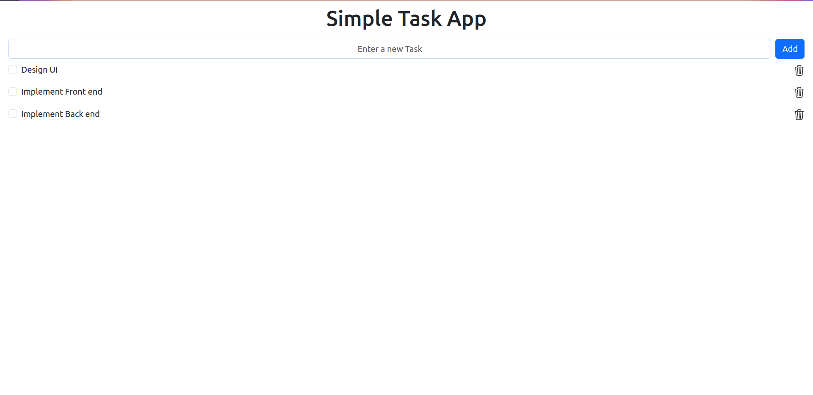
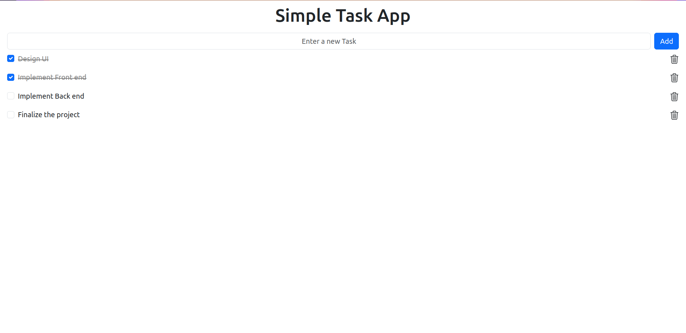

# Simple Task App

The Simple task app is a web application developed using JavaScript, Type Script, ExpressJs and Angular.  Users can easily add new tasks, update existing ones, and delete completed items, all in a few clicks. Experience the convenience of seamless task management with this Simple Task Application, where managing your to-dos becomes a breeze. Start optimizing your time and stay on top of your goals today.

## Technologies and Tools Used

### Front-End
- Angular

### Back-End
- Ecma Script
- Type Script
- ExpressJS

## Features

- Add, Update and Delete a Task.

## Getting Started

To get started with the Simple task app web application, follow these steps:

1. Clone the repository: `git clone https://github.com/KasunChathuranga3732/simple-task-app.git`
2. Set up the necessary configurations for the front-end and back-end technologies.
3. Install the required dependencies and libraries.
4. Build and deploy the application.
5. Access the application through the specified URL or port.

## License

Copyright &copy; 2023. All Rights Reserved.

## Contact

For any inquiries or support, please contact [Kasun Chathuranga](mailto:kasunchathuranga3732@gmail.com).

## Screen Shots
### Front View

